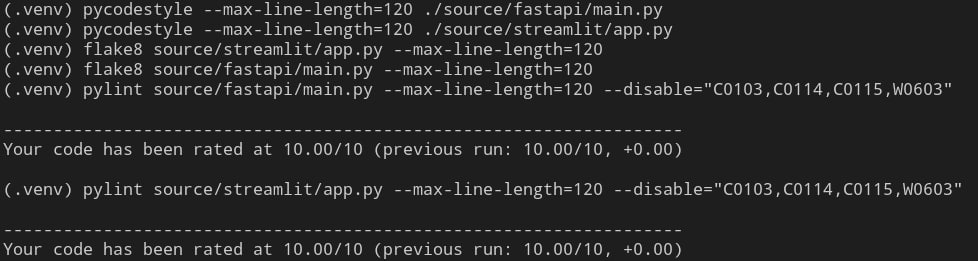

# AI24: "Биржевая и внебиржевая торговля, оптимизация портфеля" (Команда 31)

Данный проект направлен на решение задач анализа временных рядов, связанных с биржевой и внебиржевой торговлей, а также оптимизацией инвестиционного портфеля. Он сочетает в себе инструменты для обработки финансовых данных, построения моделей прогнозирования и удобный пользовательский интерфейс для взаимодействия с системой – в контексте получения актуальной информации о активах.

Команда:
- Роман Залесинский (куратор)
- Поцелуев Андрей Михайлович
- Кузьмишин Леонид Алексеевич
- Маковеев Кирилл Олегович
- Пальников Евгений Юрьевич

## Возможности проекта на текущем этапе

- **Загрузка исторических данных** по указанным тикерам и заданным временным периодам или загрузка пользовательских данных.
- **Получение информации о активе** и релевантного набора финансовых новостей, соответствующего активу.
- **Создание интерактивных визуализаций** для технического анализа временных рядов активов, а также декомпозиции и других аспектов природы данных.
- **Демонстрация информации о корреляции нескольких активов.**
- **Построение моделей временных рядов**, таких как вариации ARIMA и VAR, для прогнозирования цен.
- **Автоматизация подбора оптимальных параметров моделей.**

## Логика работы проекта

Проект построен на **FastAPI** и **Streamlit**.

### FastAPI

FastAPI позволяет:

- Обучать модели ARIMA, SARIMA и VAR с использованием пользовательских данных или финансовых данных с Yahoo Finance.
- Автоматически искать наилучшие параметры для моделей ARIMA/SARIMA.
- Прогнозировать на основе обученных моделей.
- Управлять несколькими моделями, включая установку активной модели для прогнозирования.
- Загружать наборы данных через CSV-файлы для обучения.

### Эндпоинты API

- **/fit** – Обучение модели временного ряда.

```json
{
  "data": [1.2, 3.4, 5.6],
  "model_type": "ARIMA",
  "parameters": {"order": [1, 1, 1]}
}
```

- **/fit_yahoo** - Обучение модели временного ряда с использованием данных из Yahoo Finance.

```json
{
  "ticker": "AAPL",
  "period": "1y",
  "model_type": "ARIMA",
  "parameters": {"order": [1, 1, 0]},
  "auto": false
}
```

- **/predict** - Генерация прогнозов с использованием обученной модели.

```json
{
  "model_id": "model_1",
  "steps": 10
}
```
- **/models** - Получение списка всех обученных моделей.

- **/set_model** - Установка активной модели для прогнозирования.
```json
{
  "model_id": "model_1"
}
```
- **/delete_all_models** - Удаление всех обученных моделей.

- **/upload_dataset** - Загрузка CSV-файла, содержащего данные временных рядов для обучения.

### Streamlit

Streamlit имеет две вкладки

(1) Анализ акций:

- Выбор тикера для анализа.
- Получение основной информации о компании (сектор, биржа, рыночная капитализация, текущая цена).
- Получение списка последних финансовых новостей об активе.
- Ознакомление с интерактивными графиками японских свечей и индикаторов Bollinger Bands.
- Сезонный анализ с использованием разложения временных рядов.


(2) Построение прогнозных моделей:

- Оценка стационарности временного ряда цен выбранного актива с помощью теста ADF.
- Построение автокорреляционной и частичной автокорреляционной функции для упрощения ручного выбора параметров моделей.
- Возможность выбора модели для прогнозирования и настройки параметров.
- Визуализация прогнозирования будущих шагов на основе выбранной модели.
- Отображение результатов.


# Запуск сервисов FastAPI и Streamlit

1. **FastAPI**: Сервис для обработки данных и машинного обучения.
2. **Streamlit**: Веб-интерфейс для визуализации данных и прогнозирования.


## Предварительные требования
Для запуска проекта убедитесь, что у вас установлены:
- [Docker](https://www.docker.com/)
- [Docker Compose](https://docs.docker.com/compose/)

## Установка
1. Клонируйте репозиторий:
   ```bash
   git clone https://github.com/pAndrey200/portfolio-optimization.git
   cd your-repo
   ```

## Запуск контейнеров
1. Соберите и запустите контейнеры с помощью Docker Compose:
   ```bash
   docker-compose up --build
   ```

2. После успешного запуска:
   - FastAPI будет доступен по адресу: [http://5.187.3.156:8000](http://5.187.3.156:8000)
   - Streamlit будет доступен по адресу: [http://5.187.3.156:8501](http://5.187.3.156:8501)

## Использование
- **FastAPI**:
  - Перейдите к [http://5.187.3.156:8000/docs](http://5.187.3.156:8000/docs), чтобы увидеть авто-сгенерированную документацию Swagger.
  - Используйте доступные эндпоинты для обработки данных и обучения моделей.

- **Streamlit**:
  - Перейдите к [http://5.187.3.156:8501](http://5.187.3.156:8501), чтобы открыть пользовательский интерфейс для визуализации данных и прогнозирования.

## Примечания
- Для остановки контейнеров используйте:
  ```bash
  docker-compose down
  ```

- Чтобы обновить образы после изменения кода, выполните:
  ```bash
  docker-compose up --build
  ```

- Логи приложения хранятся в директории `logs/` внутри каждого сервиса.

- Код прошел необходимые проверки качества, в том числе в контексте использования глобальных переменных:



